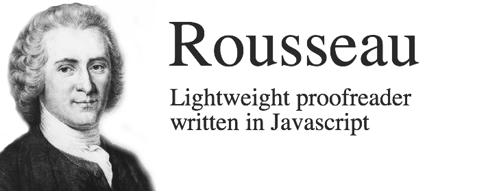

[](https://travis-ci.org/GitbookIO/rousseau)
[](http://badge.fury.io/js/rousseau)

Rousseau is a lightweight proofreader written in Javascript, it can be used in Node.JS, in the command line and in the browser.

### Installation

```
$ npm install rousseau
```

### API

```js
var rousseau = require("rousseau");

rousseau('So the cat was stolen.', function(err, results) {
    ...
});
```

`results` is an array of object like:

```js
{
    // Type of check that output this suggestion
    type: "so",

    // Level of importance
    // "suggestion", "warning", "error"
    level: "warning",

    // Index in the text
    index: 10,

    // Size of the section in the text
    offset: 2,

    // Message to describe the suggestion
    message: "omit 'So' from the beginning of sentences",

    // Replacements suggestion
    replacements: [
        {
            value: ""
        }
    ]
}
```

### Checks

You can disable any combination of the following by providing a key with value `false` as option `checks` to `rousseau`.

##### English

| ID    | Description     |
| ----- | --------------- |
| `passive` | Checks for passive voice |
| `lexical-illusion` | Checks for lexical illusions – cases where a word is repeated. |
| `so` | Checks for `so` at the beginning of the sentence. |
| `adverbs` | Checks for adverbs that can weaken meaning: really, very, extremely, etc. |
| `readibility` | Checks for readibility of sentences. |
| `simplicity` | Checks for simpler expressions |
| `weasel` | Checks for "weasel words." |
| `sentence:start` | Checks that sentence is preceded by a space |
| `sentence:end` | Checks that there is no space between a sentence and its ending punctuation |
| `sentence:uppercase` | Checks that sentences are starting with uppercase letter |


### Extend Rousseau

Example: Extend rousseau with a Spellchecker.

```js
rousseau("Some text", {
    checks: {
        spelling: rousseau.tokenize.check([
            rousseau.tokenize.words(),
            rousseau.filter(function(word) {
                return wordIsValid(word);
            }),
            rousseau.define({
                level: rousseau.levels.ERROR,
                message: "Spelling error"
            })
        ])
    }
}, function(err, results) {
    ...
})

```

### Cache

Rousseau use an internal cache for certain operations (tokenization, spellchecking, ...); this cache can be configured using the option `cache`:

```js
rousseau('So the cat was stolen.', {
    cache: 100 // A maximum of 100 elements will be stored in the memory cache
}, function(err, results) {
    ...
});
```

### Contributing

We'd love to accept your patches and contributions to improve Rousseau (supported languages, checks, ...). Learn more about how to contribute in [CONTRIBUTING.md](./CONTRIBUTING.md).
